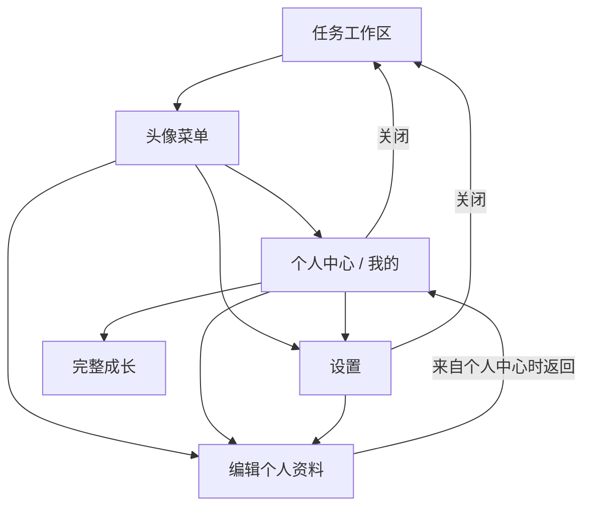

# 账号、个人中心与设置的信息架构

> 状态：本轮产品裁决，实施状态见[优化计划](../plans/profile-center-optimization.md)。
> 范围：现有任务工作区、头像菜单、个人中心、设置、成长。设计变量仍以设计系统为准。

## 1. 结论与职责

**个人资料属于设置；个人中心是身份与回顾的概览；成长是完整回顾。** 三者通过同一套导航相连，不重复资料表单或统计算法。设置侧可以显示个人资料，也应保留这一组，用户无需先经过个人中心才能修改资料。

| 用户意图 | 唯一承载位置 | 快速入口 | 返回语义 |
| --- | --- | --- | --- |
| 看自己是谁、近期状态 | 个人中心；移动端为“我的” | 桌面头像菜单 | 关闭回到原任务现场 |
| 修改昵称、头像 | 设置的个人资料组（桌面与移动端一致） | 头像菜单“编辑个人信息”、个人中心“编辑个人资料” | 从个人中心进入后可返回概览 |
| 改主题、语言、模块、默认行为 | 设置 | 头像菜单、个人中心设置入口 | 关闭回到原视图 |
| 看任务/专注/习惯的完整趋势 | 成长 | 个人中心摘要、已有成长入口 | 使用既有工作区/二级栈 |
| 改同步、AI、数据和账号安全 | 设置对应分组 | 状态行提供相关设置入口 | 保留来源，高风险操作独立确认 |

概览与编辑是同一资料的两种用途。快捷入口可以有多个，编辑位置、状态源与命名只能有一套。桌面“编辑个人信息”保留为直接操作快捷方式，不是另一张资料页。

## 2. 导航结构

桌面复用既有 sheet，同一时刻只有一个账号次级表面。概览转设置时更换标题和焦点；编辑资料落在昵称输入框；打开普通设置落在设置顶部。关闭恢复原工作区，不能把任务列表变成另一个初始状态。移动端继续五个一级 tab，不增加“资料”“成就”tab。资料编辑快捷入口直达设置的个人资料组；组内返回设置目录，关闭返回“我的”。成长、账号安全、导出等二级页都进入现有 profile 栈，顶栏返回与 Android 系统返回使用同一条 pop 路径。

## 3. 设置分组

当前桌面设置是七组，移动端设置目录是六组。这是同一职责模型在不同壳上的有意投影，不是两端实现未对齐：桌面保留“关于与帮助”，移动端只呈现已有真实配置内容。

| 组 | 收纳范围 | 不应混入 |
| --- | --- | --- |
| 个人资料 | 昵称、头像、邮箱说明 | 成就、完整统计、同步口令 |
| 任务与显示 | 外观、语言、模块、日常默认行为 | 账号注销 |
| 同步与隐私 | 连接、同步状态说明、隐私同意 | 成长回顾 |
| AI 与集成 | 提供方、本机授权、集成能力 | 用户身份编辑 |
| 数据管理 | 导入、导出、备份等 | 产品宣传卡 |
| 账号安全 | 设备、会话、凭据与危险操作 | 普通显示偏好 |
| 关于与帮助（桌面保留） | 帮助、版本、诊断入口 | 常用任务操作 |

组标题解释用户目的；内部面板标题解释具体设置。避免“设置”标题下再写“个人资料”来概括整页。桌面保留七组并以当前组高亮显示；移动端采用“设置目录 → 单个分组”，当前落地六组。关于与帮助暂不进入移动目录，因为移动端尚无对应的真实内容；这是一项范围决策，不是遗留待办，后续只有在内容准备好后才单独评估。一屏不滚过所有配置。二级分组仍在同一个 Modal 内，资料与凭据草稿保留在常驻父屏；切组重置滚动位置，关闭后普通重开回目录。安全/导出子页返回到来源分组。

## 4. 个人中心首屏与成就

桌面首屏顺序为：身份摘要 → 近期状态 → 成就预览 → 完整成长入口。移动端为：只读身份与编辑入口 → 登录/切换账号 → 设置 → 近期回顾 → 简短同步状态 → 功能入口。编辑资料靠近身份，设置为低强调入口。身份必须显示真实昵称和可解密头像，读取中回退邮箱/首字母；不得把读取失败说成“你尚未设置”。网络读取遵守已有隐私同意，失败不能让本地统计与设置消失。

近期状态只展示本周任务、专注分钟和习惯打卡。数值用一组紧凑排版，不为三个数字各造一张大型卡片。成就展示达成数量和下一项目标/差距，完整四类里程碑、热力图、连续性仍留在成长。首版不宣称“最近获得”：现有数据没有解锁时间。

移动端不在个人中心内联清单、标签、便签编辑器，保留“整理与记录”二级入口；导出、回收站与账号安全归设置。详细同步读数与重试归同步组，概览仅显示状态。统计订阅本地写入与同步更新，不能等登录或同步后才刷新。

“成就不惩罚中断”指不因缺勤扣分；用户撤销完成或删除记录后，统计会按现有物化数据重算，不承诺永远不减。不要为徽章发明新的持久化事实。

Web 关闭成长模块后，个人中心不得保留成就及跳转入口。移动端目前使用固定二级功能目录，没有同一模块开关；不虚构跨端已同步的开关语义。无账号仍能使用本地成长入口，账号登录不是本地统计的前置条件。

## 5. 状态与反馈

| 情况 | 界面行为 |
| --- | --- |
| 本机使用 | 显示本机状态与登录入口，不显示退出登录；本地数据仍可回顾 |
| 已登录 | 显示身份；切换账号明确命名，不能仍显示“注册 / 登录” |
| 资料读取失败 | 保留邮箱回退与可重试/编辑入口，不显示假昵称或假成功 |
| 头像口令缺失 | 使用首字母回退；解释当前设备需解锁，不推断服务端没有头像 |
| 没有活动记录 | 显示真实 0 与正常目标，不用错误色，不用虚假示例数据 |
| 进入编辑资料 | 聚焦昵称，保存有成功/失败反馈，返回可看到新身份 |
| 切换账号 | 清除前一个账号的资料读数；迟到请求不得覆盖新账号 |

## 6. 对照依据与取舍

- [Todoist：更改名字或头像](https://www.todoist.com/zh-CN/help/articles/change-your-name-or-avatar-photo-pPt111AI)，2026-10-07 读取官方正文，明确头像 → 设置、修改/移除头像。采用其“统一编辑位置”；没有照搬商业升级入口。
- [Things：创建 Things Cloud 账号](https://culturedcode.com/things/support/articles/1481195/)，同日读取，账号创建位于 Settings → Things Cloud。采用其“账号服务于同步”思路；该来源只证明账号路径，不能据此声称已审查 Things 全部 Profile UI。
- TickTick 的统计/徽章采用仓库已有[竞品激励拆解](../research/competitor-incentive-teardown.md) §6 与官方来源链接。本轮帮助站访问未成功，标为既有调研复用，未声称本轮真机复核。
- 现有[设计系统](../../design-system/heyta/MASTER.md)约束层级、暗色、焦点、触控与图标；不额外复制 token 表。

## 7. 验收以用户旅程为单位

1. 从任务进入个人中心，查看身份；编辑昵称；返回概览；关闭回任务，来源与焦点正确。
2. 从头像直接进设置/编辑资料，不必先经过个人中心。
3. 关闭成长后所有桌面账号入口一致隐藏成长；重新启用恢复。
4. 长昵称/邮箱、390px、暗色可读，身份操作和关闭按钮都在可见区域。
5. 移动端“我的”能尽早找到设置；设置/成长返回仍在“我的”，登录与切换账号文案匹配状态。

这些旅程与截图用于验收 IA/UX；类型、单测和安装检查提供底线证据，不能替代产品判断。
